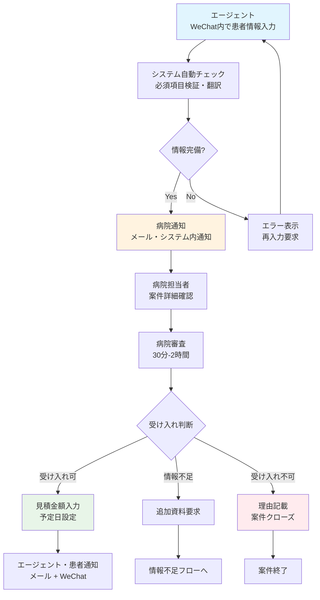
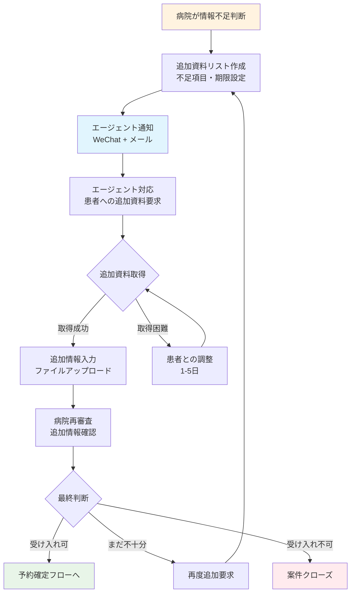
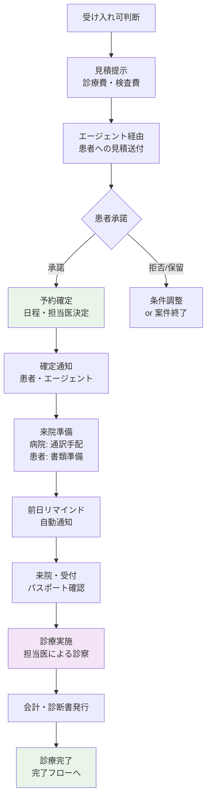
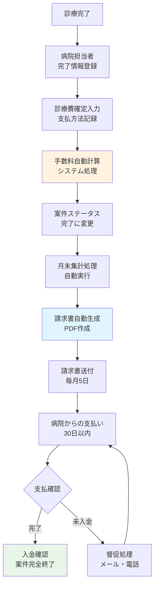
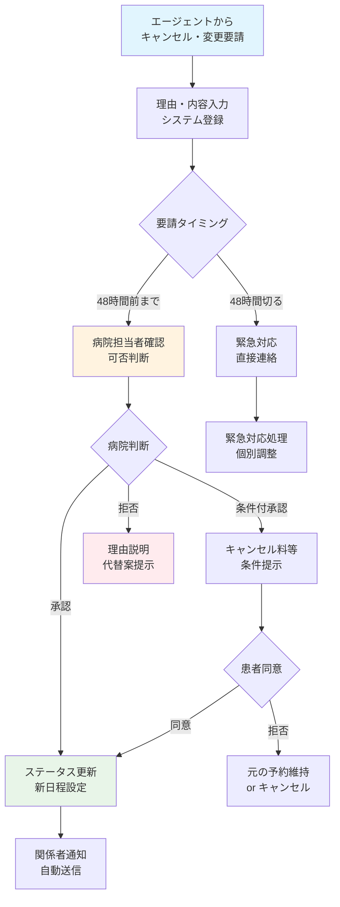
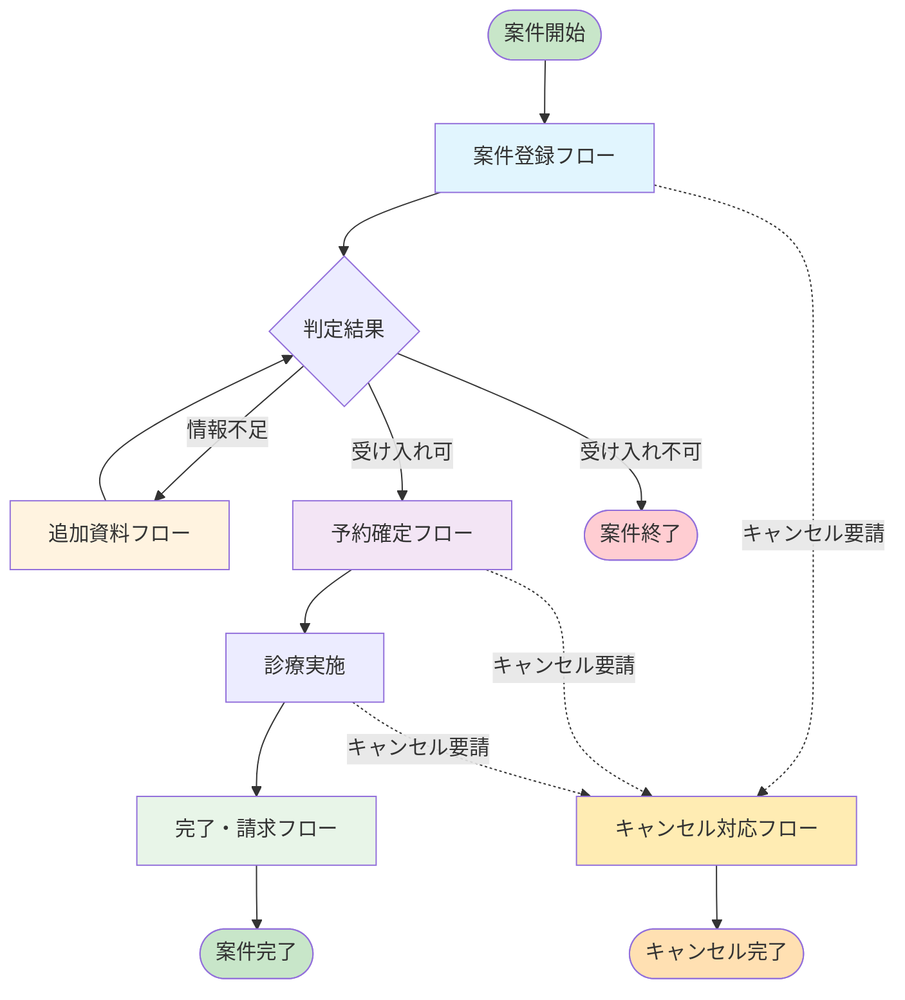
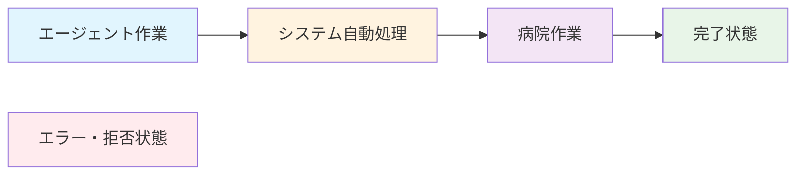

# 医療ツーリズムCRM 業務フロー図

**文書作成日**: 2025年07月28日  
**バージョン**: 1.0  
**作成者**: 株式会社yolidoli 代表取締役 船曳陸斗

---

## 1. 案件登録から受け入れ判断まで

## 2. 情報不足・追加資料要求フロー

## 3. 予約確定から診療実施まで

## 4. 診療完了から請求まで

## 5. キャンセル・変更対応フロー

## 6. 全体俯瞰図

## 凡例

---

## 使用方法

1. **GitHub/GitLab**: このファイルを開くと自動的に図が表示されます
2. **VS Code**: Mermaid拡張機能をインストールすると図が表示されます
3. **オンラインツール**: [Mermaid Live Editor](https://mermaid.live/) で編集・表示可能

## 更新履歴

- v1.0 (2025/07/28): 初版作成 - 5つの主要フロー図を作成